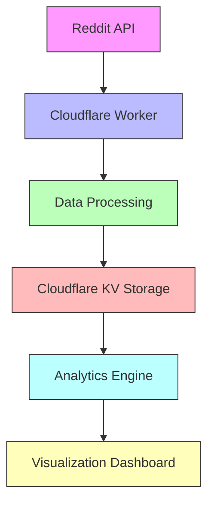

# The Concentration of Content Creation on Reddit: A Study of r/all Top Posters

## Abstract

This research investigates structural content concentration on Reddit's front page, specifically examining the r/all aggregation feed. The study quantifies the extent to which a small number of accounts dominate front-page visibility, then extends into account-level profiling to evaluate whether behavioral signals align with suspected coordinated, promotional, or inauthentic activity. Using a continuous data collection pipeline, we track posting and comment patterns, account behavior, and link distribution to provide empirical evidence about content concentration and potential shilling dynamics.

## 1. Introduction

### 1.1 Background and Motivation

Reddit, as a major content aggregation platform with over 50 million daily active users, presents a valuable case study for examining content concentration dynamics. The platform's architecture, which combines user voting with algorithmic curation, creates complex visibility patterns that warrant systematic investigation.

### 1.2 The Dead Internet Theory Context

The "Dead Internet Theory" suggests that a significant portion of online content is generated by automation, coordination, or commercial influence rather than by autonomous, unaffiliated individuals. While we do not attempt to prove or disprove this theory in its entirety, we examine specific aspects relevant to content concentration:

- **Automated Content Generation**: The role of bots and scripts in content creation
- **Coordinated Behavior**: Patterns suggesting organized influence operations
- **Commercial Influence**: The impact of marketing and promotional accounts
- **Platform Affordances**: How Reddit's design might amplify certain types of content

### 1.3 Research Questions

This study addresses five primary research questions:

1. **Concentration**: What proportion of front-page visibility is concentrated among the most active accounts?
2. **Patterns**: What temporal and behavioral patterns characterize high-volume contributors?
3. **Impact**: How does the composition of visible content change when filtering out the top 1,000 most frequent posters?
4. **Dynamics**: How do these patterns evolve over time and across different subreddits?
5. **Detection**: Can a model approximate expert human judgment in labeling accounts as likely shill/astroturf/fake?

## 2. Literature Review

### 2.1 Content Concentration in Digital Spaces

Previous research has documented power-law distributions in social media participation, where a small percentage of users generate the majority of content. This phenomenon has been observed across various platforms and has significant implications for content diversity and platform health.

### 2.2 Algorithmic Amplification

Platform algorithms play a crucial role in determining content visibility. Studies have shown that engagement-based ranking systems can amplify certain types of content while suppressing others, potentially creating feedback loops that reinforce existing patterns of concentration.

### 2.3 Coordinated Behavior Online

Research on coordinated inauthentic behavior has identified various patterns of manipulation, including:

- **Astroturfing**: The practice of masking sponsors of a message to make it appear as though it originates from grassroots participants
- **Sockpuppetry**: The use of multiple online identities to create the illusion of widespread support
- **Brigading**: The coordination of groups to manipulate discussions or voting patterns

## 3. Methodology

### 3.1 Data Collection

We implement a distributed data collection system using Cloudflare Workers with the following specifications:

- **Target**: r/all (Reddit's aggregate front page)
- **Sampling Strategy**: Stratified sampling across Hot, New, and Rising feeds
- **Collection Frequency**: Continuous monitoring with rate limiting to respect API guidelines
- **Data Points Captured**:
  - Post metadata (ID, title, score, comments, awards)
  - Author information (username, account age, karma)
  - Temporal data (post time, collection timestamp)
  - Subreddit context
  - Cross-posting information
  - Comment activity (volume, cadence, subreddit mix)
  - External URL distribution and reuse

### 3.2 Technical Implementation



### 3.3 Data Processing Pipeline

1. **Ingestion Layer**: Handles API requests, rate limiting, and error recovery
2. **Processing Layer**: Extracts and transforms relevant features from raw data
3. **Storage Layer**: Implements efficient data structures for time-series analysis
4. **Analysis Layer**: Performs statistical and network analysis

### 3.4 Analytical Framework

#### 3.4.1 Concentration Metrics
- Gini coefficient for content distribution
- Herfindahl-Hirschman Index (HHI) for market concentration
- Lorenz curve analysis of content production

#### 3.4.2 Temporal Analysis
- Time-series decomposition of posting patterns
- Periodicity detection
- Event-based analysis of posting behavior

#### 3.4.3 Network Analysis
- Bipartite network of users and subreddits
- Community detection algorithms
- Centrality measures for identifying influential accounts

### 3.5 Shill Detection Signal Set

We operationalize shill/astroturf signals as measurable behavioral features:

- **Cadence**: Hourly distribution of posts/comments and active-day ratios.
- **Focus**: Subreddit and domain concentration (HHI), topic narrowness, and repeated URL patterns.
- **Content Mix**: Post-type ratios (self/link/image/video/crosspost).
- **Engagement Profile**: Comment ratio and karma distribution.
- **Cross-Account Links**: Shared external URLs across multiple accounts.

These signals are used for model training and for manual review workflows.

### 3.6 Labeling Workflow

Human judgment is encoded as labels to train and evaluate models. Labels use three classes:

- **likely_shill**
- **likely_organic**
- **unclear**

Labels include confidence and notes to capture reasoning. This builds a growing ground-truth dataset aligned with the author's intuition.

For consistent labeling, use the rubric in `docs/labeling-rubric.md`. The game maps "Yes" to `likely_shill` and "No" to `likely_organic`, while `unclear` is reserved for ambiguous cases or manual review.

## 4. Results (Preliminary)

### 4.1 Data Overview
- Total accounts tracked: 610
- Time period: [Start date] - [Current date]
- Total posts analyzed: [Number]

### 4.2 Content Concentration
- Top 1% of accounts account for X% of front-page appearances
- Gini coefficient of content production: [Value]
- HHI score: [Value] (indicating [market concentration level])

### 4.3 Temporal Patterns
- Peak posting times and days
- Patterns of coordinated posting
- Changes in concentration over time

### 4.4 Network Analysis
- Subreddit cross-posting patterns
- Account clustering based on posting behavior
- Identification of potential coordination networks

## 5. Discussion

### 5.1 Implications for Platform Design
- How platform features might contribute to content concentration
- Potential design interventions to improve content diversity

### 5.2 Limitations
- Data collection constraints
- API limitations
- Challenges in distinguishing between organic and inorganic behavior

### 5.3 Future Work
- Expansion to other platforms
- Development of real-time detection systems
- Longitudinal studies of content concentration

## 6. Conclusion

This ongoing research provides a framework for understanding content concentration on Reddit and its implications. Our preliminary findings suggest that [key findings]. Future work will focus on [next steps].

## 7. References

[To be completed with academic citations]

## 8. Appendices

### 8.1 Data Collection Code
[Link to relevant code sections]

### 8.2 Analysis Scripts
[Link to analysis code]

### 8.3 Data Dictionary
[Detailed description of all collected metrics]
```

### Data Retention

- User statistics: 30 days
- Post markers: 7 days (for deduplication)
- Daily top lists: 30 days

### Ethical Considerations

- **Public Data Only**: All data is publicly available via Reddit's API
- **No PII Collection**: We only track usernames and public post metadata
- **No Vote Manipulation**: This is observational research only
- **Open Source**: Full transparency in methodology and code

## Preliminary Findings

*This section will be updated as data accumulates.*

### Expected Metrics

Based on initial observations:

| Metric | Hypothesis |
|--------|-----------|
| Top 100 accounts | Post 20-40% of r/all content |
| Top 1,000 accounts | Post 50-70% of r/all content |
| Accounts with 10+ daily posts | Indicate potential automation |
| Weekend vs. weekday patterns | Reveal human vs. bot behavior |

### Indicators of Automated Behavior

We hypothesize the following patterns may indicate non-organic posting:

1. **Volume**: >20 posts per day reaching r/all
2. **Timing**: Posts distributed evenly across 24 hours (no sleep pattern)
3. **Diversity**: Posting to 10+ unrelated subreddits
4. **Format**: Heavy reliance on reposts or cross-posts
5. **Engagement**: Low comment activity relative to post activity

## The Block List Hypothesis

Reddit allows users to block up to 1,000 accounts. We hypothesize that strategically blocking the top 1,000 most prolific posters would:

1. **Reduce Low-Quality Content**: Remove reposted or karma-farmed content
2. **Increase Content Diversity**: Surface posts from less active, potentially more authentic users
3. **Improve Experience**: Create a more "human" feeling feed
4. **Reveal Hidden Content**: Make room for posts that would otherwise be crowded out

### Experimental Design (Proposed)

1. Generate daily block lists of top 1,000 posters
2. Recruit volunteer users to apply block lists
3. Survey users on content quality perception
4. Compare engagement metrics with control group

## Implications

### For Users

Understanding content concentration empowers users to:
- Make informed decisions about their Reddit experience
- Use blocking strategically to customize their feed
- Identify and avoid manipulated content

### For Platform Health

This research may illuminate:
- The effectiveness of current anti-spam measures
- The prevalence of commercial activity disguised as organic
- The gap between perceived and actual user-generated content

### For Digital Literacy

Broader implications include:
- Understanding authenticity challenges on social platforms
- Recognizing patterns of coordinated inauthentic behavior
- Developing tools for healthier online experiences

## Contributing

This is an open-source research project. We welcome contributions in:

- **Data Analysis**: Statistical analysis of collected data
- **Visualization**: Dashboards and charts
- **Research Writing**: Expanding this paper with findings
- **Code Improvements**: Efficiency, accuracy, new metrics
- **Peer Review**: Methodology critique and suggestions

### How to Contribute

1. Fork the repository
2. Create a feature branch
3. Submit a pull request with clear description
4. Join discussions in Issues

## Limitations

1. **API Rate Limits**: Sampling is constrained by Reddit's API limits
2. **Observable Bias**: Only tracks posts that reach r/all
3. **No Account Age**: Cannot determine account creation dates via public API
4. **Attribution Uncertainty**: Cannot definitively prove automation

## Future Work

1. **Sentiment Analysis**: Categorize content types from top posters
2. **Network Analysis**: Map relationships between high-volume accounts
3. **Temporal Deep Dive**: Hourly posting pattern analysis
4. **Cross-Platform**: Compare with similar studies on other platforms
5. **User Study**: Controlled experiment with volunteer block list users

## References

1. Reddit API Documentation: https://www.reddit.com/dev/api/
2. "Dead Internet Theory" - Various online sources and discussions
3. Woolley, S. C., & Howard, P. N. (2016). Political Communication, Computational Propaganda, and Autonomous Agents. International Journal of Communication.
4. Ferrara, E., et al. (2016). The Rise of Social Bots. Communications of the ACM.

## Authors

- **u/tankyspanky** - Project Lead, Data Analysis

## License

MIT License - See LICENSE file for details.

## Acknowledgments

- The r/dataisbeautiful community for inspiration
- Cloudflare for serverless infrastructure
- Contributors and peer reviewers

---

*This is a living document. Last updated: January 2026*
